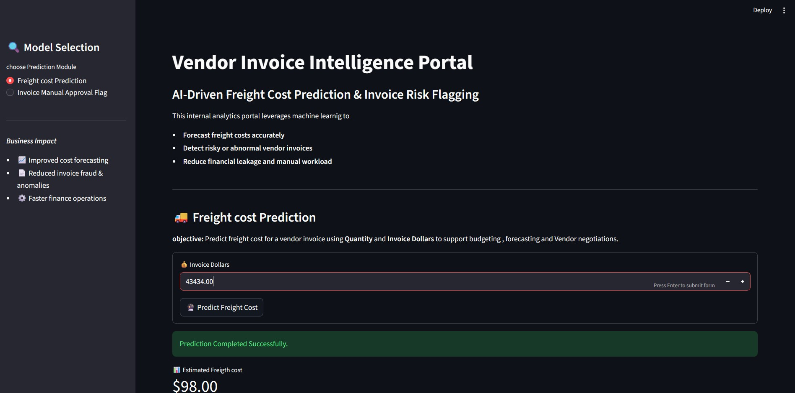
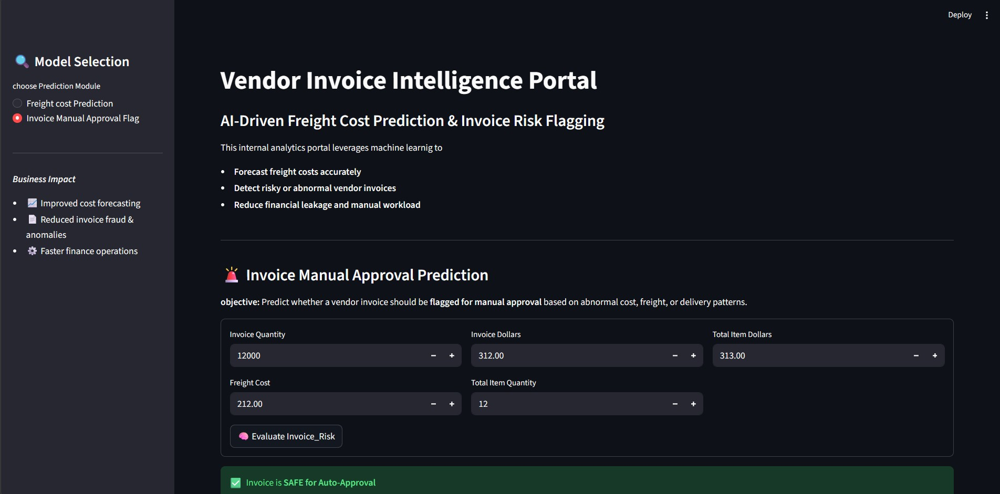

# 🚚 Vendor Invoice Intelligence System

### Freight Cost Prediction & Invoice Risk Detection
## 🚀 Live
👉 https://rajeevkumar-me-freight-intelligence.streamlit.app

---

## 📌 Overview

This project is an end-to-end data science system designed to:

* **Predict freight costs** using machine learning
* **Detect risky or anomalous invoices** using rule-based + ML logic

It combines data preprocessing, model training, inference pipelines, and a deployable interface to simulate real-world business use cases in logistics and finance.

---

## 🎯 Objective

* Reduce uncertainty in freight cost estimation
* Identify suspicious or inconsistent invoices
* Provide actionable insights for vendor and logistics optimization

---

## 🧠 Key Features

* 📊 Freight cost prediction (Regression model)
* 🚨 Invoice risk flagging (Classification + rules)
* ⚙️ Pretrained models (no large dataset required to run)
* 📈 End-to-end ML pipeline (data → model → inference)
* 🖥️ Ready for deployment via Streamlit

---

## 🏗️ Project Structure

```bash
freight_cost/
│
├── Freight_cost_prediction/
│   ├── train.py
│   ├── data_preprocessing.py
│   ├── modeling_evaluation.py
│
├── invoice_flagging/
│   ├── train.py
│   ├── data_preprocessing.py
│   ├── modeling_evaluation.py
│
├── inference/
│   ├── predict_freight.py
│   ├── predict_invoice_flag.py
│
├── models/
│   ├── predict_freight_model.pkl
│   ├── predict_flag_invoice.pkl
│   ├── scaler.pkl
│
├── notebooks/
│   ├── Freight_cost.ipynb
│   ├── Invoice Flagging.ipynb
│
├── app.py
├── images/
└── README.md
```

---

## ⚙️ Tech Stack

* **Python**
* **Pandas, NumPy**
* **Scikit-learn**
* **Matplotlib / Seaborn**
* **Streamlit**
* **Joblib (model persistence)**

---

## 📊 Models Used

### Freight Cost Prediction

* Regression-based model
* Predicts freight cost based on:

  * Invoice value
  * Quantity
  * Vendor metrics
  * Receiving delays

### Invoice Risk Detection

* Classification / rule-based hybrid
* Flags invoices based on:

  * Value mismatch
  * Delay anomalies
  * Behavioral inconsistencies

---

## 🚀 How to Run

### 1️⃣ Clone the repository

```bash
git clone https://github.com/your-username/freight-cost-prediction.git
cd freight-cost
```

### 2️⃣ Install dependencies

```bash
pip install -r requirements.txt
```

### 3️⃣ Run the application

```bash
streamlit run app.py
```

---

## 📁 Dataset Note

The original dataset used for training is large and not included in this repository.

✔ A trained model is provided (`.pkl` files)
✔ The system works directly using pretrained models

---

## 📸 Project Demo of Vendor Invoice Intelligence

## 📸 Freight cost


## 📸 Invoice Flagging


---

## 💡 Key Insights

* Freight cost increases with receiving delays
* Vendor inconsistencies can signal risk
* Bulk shipments optimize cost efficiency

---

## 🔮 Future Improvements

* Deploy as REST API (FastAPI)
* Add real-time data pipeline
* Improve feature engineering
* Integrate dashboard (Power BI / Streamlit advanced UI)

---

## 👤 Author

**Rajeev Kumar**
Data Science & AI

---

## ⭐ Conclusion

This project demonstrates the ability to:

* Build **end-to-end ML systems**
* Handle **real-world business problems**
* Deliver **deployable and scalable solutions**

It reflects a strong focus on **practical data science, not just modeling**.
